# DER — EduConnect

Abaixo está o DER do EduConnect em **Mermaid ER Diagram**.  
Você pode abrir este arquivo em editores que suportam Mermaid ou usar o bloco abaixo no README do projeto.

```mermaid
erDiagram

    PERFIS {
        int PerfilId PK
        string Nome
    }

    USUARIOS {
        int UsuarioId PK
        int PerfilId FK
        string Registro
        string Email
        string SenhaHash
        bool Ativo
        datetime DataCriacao
        datetime UltimoAcesso
        bool PrecisaTrocarSenha
    }

    ADMINISTRADORES {
        int AdministradorId PK
        int UsuarioId FK
        string NomeCompleto
    }

    PROFESSORES {
        int ProfessorId PK
        int UsuarioId FK
        string Registro
        string NomeCompleto
        datetime DataNascimento
        string EmailInstitucional
        string Status
    }

    ALUNOS {
        int AlunoId PK
        int UsuarioId FK
        string Registro
        string NomeCompleto
        datetime DataNascimento
        string FotoUrl
        decimal ValorMensalPadrao
        bool Ativo
    }

    RESPONSAVEIS {
        int ResponsavelId PK
        int UsuarioId FK
        string Registro
        string NomeCompleto
        string Telefone
        string EmailContato
    }

    RESPONSAVEIS_ALUNOS {
        int ResponsavelId FK
        int AlunoId FK
        string TipoResponsabilidade
        bool Principal
    }

    NIVEIS_ENSINO {
        int NivelEnsinoId PK
        string Nome
    }

    DISCIPLINAS {
        int DisciplinaId PK
        int NivelEnsinoId FK
        string Nome
        string Codigo
        string Descricao
    }

    TURMAS {
        int TurmaId PK
        int NivelEnsinoId FK
        string Nome
        int AnoLetivo
        string Sala
        string ProfessorTutorNome
        string Descricao
    }

    PROFESSORES_DISCIPLINAS {
        int ProfessorDisciplinaId PK
        int ProfessorId FK
        int DisciplinaId FK
        int NivelEnsinoId FK
        int CargaHorariaSemanal
    }

    TURMAS_PROFESSORES_DISCIPLINAS {
        int TurmaProfessorDisciplinaId PK
        int TurmaId FK
        int ProfessorId FK
        int DisciplinaId FK
        datetime DataVinculo
    }

    TURMAS_ALUNO {
        int TurmaAlunoId PK
        int TurmaId FK
        int AlunoId FK
        datetime DataEntrada
        bool Ativo
    }

    NOTAS {
        int NotaId PK
        int AlunoId FK
        int TurmaId FK
        int DisciplinaId FK
        int LancadoPorProfessorId FK
        string TipoAvaliacao
        decimal Valor
        datetime DataLancamento
    }

    HISTORICOS_NOTAS {
        int HistoricoNotaId PK
        int NotaId FK
        decimal ValorAnterior
        decimal ValorNovo
        datetime DataAlteracao
        int AlteradoPorUsuarioId FK
    }

    FREQUENCIAS {
        int FrequenciaId PK
        int AlunoId FK
        int TurmaId FK
        int DisciplinaId FK
        int RegistradoPorProfessorId FK
        datetime DataAula
        bool Presente
        string Observacao
    }

    OCORRENCIAS {
        int OcorrenciaId PK
        int AlunoId FK
        int TurmaId FK
        int ProfessorId FK
        string Descricao
        datetime DataOcorrencia
    }

    AGENDA_EVENTOS {
        int AgendaEventoId PK
        int TurmaId FK
        int CriadoPorProfessorId FK
        string Titulo
        string Descricao
        datetime DataEvento
    }

    MATERIAIS_APOIO {
        int MaterialApoioId PK
        int TurmaId FK
        int ProfessorId FK
        string Titulo
        string Descricao
        string ArquivoUrl
        datetime DataPublicacao
    }

    PUBLICACOES {
        int PublicacaoId PK
        int CriadoPorAdministradorId FK
        string Titulo
        string Conteudo
        datetime DataPublicacao
    }

    INTERESSES_MATRICULA {
        int InteresseMatriculaId PK
        string NomeAluno
        datetime DataNascimentoAluno
        string NomeResponsavel
        string Telefone
        string Email
        string DocumentoAlunoUrl
        string DocumentoResponsavelUrl
        string AnoEscolarAtual
        string Observacoes
        string Status
        datetime DataCriacao
        datetime DataConclusao
    }

    MENSALIDADES {
        int MensalidadeId PK
        int ResponsavelId FK
        int AlunoId FK
        string Competencia
        decimal Valor
        string StatusPagamento
        datetime DataVencimento
        datetime DataPagamento
        string Observacao
    }

    NOTIFICACOES {
        int NotificacaoId PK
        int UsuarioId FK
        string Titulo
        string Mensagem
        bool Lida
        datetime DataCriacao
    }

    RECUPERACOES_SENHA_TOKEN {
        int RecuperacaoSenhaTokenId PK
        int UsuarioId FK
        string Token
        datetime ExpiraEm
        bool Usado
        datetime DataCriacao
    }

    PERFIS ||--o{ USUARIOS : possui
    USUARIOS ||--o| ADMINISTRADORES : representa
    USUARIOS ||--o| PROFESSORES : representa
    USUARIOS ||--o| ALUNOS : representa
    USUARIOS ||--o| RESPONSAVEIS : representa
    USUARIOS ||--o{ RECUPERACOES_SENHA_TOKEN : gera
    USUARIOS ||--o{ NOTIFICACOES : recebe

    RESPONSAVEIS ||--o{ RESPONSAVEIS_ALUNOS : vincula
    ALUNOS ||--o{ RESPONSAVEIS_ALUNOS : vincula

    NIVEIS_ENSINO ||--o{ DISCIPLINAS : classifica
    NIVEIS_ENSINO ||--o{ TURMAS : organiza
    NIVEIS_ENSINO ||--o{ PROFESSORES_DISCIPLINAS : contextualiza

    PROFESSORES ||--o{ PROFESSORES_DISCIPLINAS : habilita
    DISCIPLINAS ||--o{ PROFESSORES_DISCIPLINAS : habilitada

    TURMAS ||--o{ TURMAS_PROFESSORES_DISCIPLINAS : possui
    PROFESSORES ||--o{ TURMAS_PROFESSORES_DISCIPLINAS : alocado
    DISCIPLINAS ||--o{ TURMAS_PROFESSORES_DISCIPLINAS : leciona

    TURMAS ||--o{ TURMAS_ALUNO : possui
    ALUNOS ||--o{ TURMAS_ALUNO : participa

    ALUNOS ||--o{ NOTAS : recebe
    TURMAS ||--o{ NOTAS : contextualiza
    DISCIPLINAS ||--o{ NOTAS : referencia
    PROFESSORES ||--o{ NOTAS : lanca
    NOTAS ||--o{ HISTORICOS_NOTAS : historico
    USUARIOS ||--o{ HISTORICOS_NOTAS : altera

    ALUNOS ||--o{ FREQUENCIAS : possui
    TURMAS ||--o{ FREQUENCIAS : contextualiza
    DISCIPLINAS ||--o{ FREQUENCIAS : referencia
    PROFESSORES ||--o{ FREQUENCIAS : registra

    ALUNOS ||--o{ OCORRENCIAS : recebe
    TURMAS ||--o{ OCORRENCIAS : contextualiza
    PROFESSORES ||--o{ OCORRENCIAS : registra

    TURMAS ||--o{ AGENDA_EVENTOS : possui
    PROFESSORES ||--o{ AGENDA_EVENTOS : cria

    TURMAS ||--o{ MATERIAIS_APOIO : possui
    PROFESSORES ||--o{ MATERIAIS_APOIO : publica

    ADMINISTRADORES ||--o{ PUBLICACOES : publica

    RESPONSAVEIS ||--o{ MENSALIDADES : responsavel
    ALUNOS ||--o{ MENSALIDADES : referencia
```

## Observações
- `ProfessorDisciplina` representa a **habilitação** do professor: ele **pode lecionar** uma disciplina em um nível.
- `TurmaProfessorDisciplina` representa a **alocação real**: ele **vai lecionar** essa disciplina em uma turma.
- `ResponsavelAluno` modela o vínculo N:N entre responsáveis e alunos.
- `RecuperacoesSenhaToken` suporta o fluxo de redefinição de senha.
- O seed inicial cria o perfil e o usuário administrador padrão, além do registro em `Administradores`.
